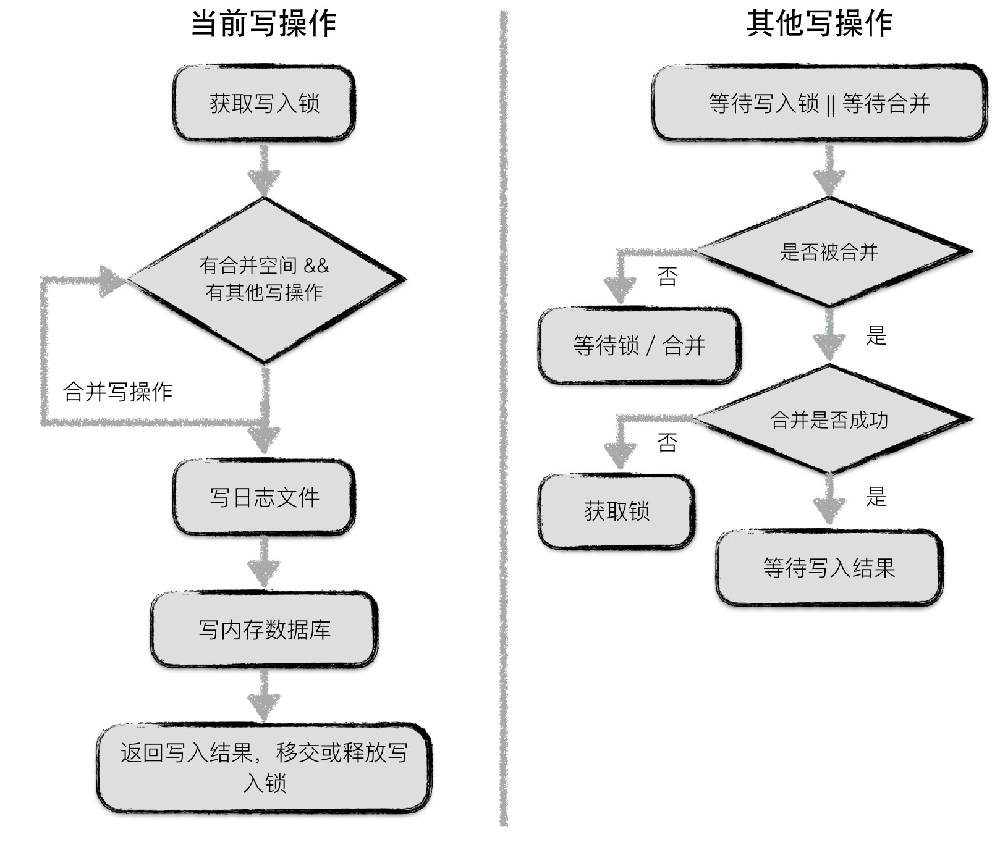

# 读写操作

## 写操作

LevelDB 以其优秀的写性能著名，在本文中就先来分析一下 LevelDB 整个写入的流程，底层数据结构的支持以及为何能够获取极高的写入性能。

### 整体流程

LevelDB 的一次写入分为两部分：

1. 将写操作写入日志
2. 将写操作应用到内存数据库中

之前已经阐述过为何这样的操作可以获得极高的写入性能，以及通过先写日志的方法能够保障用户的写入不丢失。

> **注解**  
> 其实 LevelDB 仍然存在写入丢失的隐患。在写完日志文件以后，操作系统并不是直接将这些数据真正落到磁盘中，而是暂时留在操作系统缓存中，因此当用户写入操作完成，操作系统还未来得及落盘的情况下，发生系统宕机，就会造成写丢失；但是若只是进程异常退出，则不存在该问题。

### 写类型

LevelDB 对外提供的写入接口有：
1. `Put`
2. `Delete`

这两种本质对应同一种操作，`Delete` 操作同样会被转换成一个 `value` 为空的 `Put` 操作。

除此以外，LevelDB 还提供了一个批量处理的工具 `Batch`，用户可以依据 `Batch` 来完成批量的数据库更新操作，且这些操作是原子性的。

### batch 结构

无论是 `Put`/`Delete` 操作，还是批量操作，底层都会为这些操作创建一个 `Batch` 实例作为一个数据库操作的最小执行单元。因此首先介绍一下 `Batch` 的组织结构。

在 `Batch` 中，每一条数据项都按照上图格式进行编码。每条数据项编码后的第一位是这条数据项的类型（更新还是删除），之后是数据项 `key` 的长度，数据项 `key` 的内容；若该数据项不是删除操作，则再加上 `value` 的长度，`value` 的内容。

`Batch` 中会维护一个 `size` 值，用于表示其中包含的数据量的大小。该 `size` 值为所有数据项 `key` 与 `value` 长度的累加，以及每条数据项额外的 8 个字节。这 8 个字节用于存储一条数据项额外的一些信息。

### `key` 值编码

当数据项从 `Batch` 中写入到内存数据库中是，需要将一个 `key` 值的转换，即在 LevelDB 内部，所有数据项的 `key` 是经过特殊编码的，这种格式称为 `internalKey`。

`internalkey` 在用户 `key` 的基础上，尾部追加了 8 个字节，用于存储
1. 该操作对应的 sequence number
2. 该操作的类型

其中，每一个操作都会被赋予一个 sequence number。该计时器是在 LevelDB 内部维护，每进行一次操作就做一个累加。由于在 LevelDB 中，一次更新或者一次删除，采用的是 append 的方式，并非直接更新原数据。因此对应同样一个 `key`，会有多个版本的数据记录，而最大的 sequence number 对应的数据记录就是最新的。

此外，LevelDB 的快照（snapshot）也是基于这个 sequence number 实现的，即每一个 sequence number 代表着数据库的一个版本。

### 合并写

LevelDB 中，在面对并发写入时，做了一个处理的优化。在同一个时刻，只允许一个写入操作将内容写入到日志文件以及内存数据库中。为了在写入进程较多的情况下，减少日志文件的小写入，增加整体的写入性能，LevelDB 将一些“小写入”合并成一个“大写入”。

流程如下：

**第一个获取到写锁的写操作**

- 第一个写入操作获取到写入锁；
- 在当前写操作的数据量未超过合并上限，且有其他写操作 pending 的情况下，将其他写操作的内容合并到自身；
- 若本次写操作的数据量超过上限，或者无其他 pending 的写操作了，将所有内容统一写入日志文件，并写入到内存数据库中；
- 通知每一个被合并的写操作最终的写入结果，释放或移交写锁；

> Q：什么情况下会移交锁

**其他写操作**：

- 等待获取写锁或者被合并；
- 若被合并，判断是否合并成功。若成功，则等待最终写入结果；反之，则表明获取锁的写操作已经 oversize 了，此时，该操作直接从上个占有锁的写操作中接过写锁进行写入；
- 若未被合并，则继续等待写锁或者等待被合并；

### 原子性

LevelDB 的任意一个写操作（无论包含了多少次写），其原子性都是由日志文件实现的。一个写操作中所有的内容会以一个日志中的一条记录作为最小单位写入。

考虑以下两种异常情况：

1. 写日志未开始，或写日志完成一半，进程异常退出
    - 这种情况下，存储一个写操作的部分写可能已经被记载到日志文件中，仍然有部分写未被记录，这种情况下，当数据库重新启动恢复时，读到这条日志记录时，发现数据异常，直接丢弃或退出，实现了写入的原子性保障。
2. 写日志完成，进程异常退出
    - 写日志已经完成，已经数据未真正持久化，数据库启动恢复时通过重放日志实现数据写入，仍然保障了原子性。

### 日志、内存数据库

这部分数据将由 [日志][journal] 和 [内存数据库][memdb] 两篇文章详细分析。

## 读操作

LevelDB 提供给用户两种进行读取数据的接口：

1. 直接通过 `Get` 接口读取数据
2. 首先创建一个 snapshot，基于该 snapshot 调用`Get`接口读取数据

两者的本质是一样的，只不过第一种调用方式默认地以当前数据库的状态创建了一个 snapshot，并基于此 snapshot 进行读取。

读者可能不了解 snapshot（快照）到底是什么？简单地来说，就是数据库在某一个时刻的状态。基于一个快照进行数据的读取，读到的内容不会因为后续数据的更改而改变。

由于两种方式本质都是基于快照进行读取的，因此在介绍读操作之前，首先介绍快照。

### 快照

快照代表着数据库某一个时刻的状态，在 LevelDB 中，作者巧妙地用一个整型数来标识一个数据库状态。

在 LevelDB 中，用户对同一个 key 的若干次修改（包括删除）是以维护多条数据项的方式进行存储的（直至进行 compaction 时才会合并成同一条记录），每条数据项都会被赋予一个序列号，代表这条数据项的新旧状态。一条数据项的序列号越大，表示其中代表的内容为最新值。

**因此，每一个序列号，其实就标识着 LevelDB 的一个状态**。换句话说，每一个序列号都可以作为一个状态快照。

当用户主动或者被动地创建一个快照时，LevelDB 会以当前最新的序列号对其赋值。例如图中用户在序列号为 98 的时刻创建了一个快照，并且基于该快照读取 key 为 “name” 的数据时，即便此刻用户将 “name” 的值修改为 “dog”，再删除，用户读取到的内容仍然是 “cat”。

所以，利用快照能够保证数据库进行并发的读写操作。

在获取到一个快照之后，LevelDB 会为本次查询的key构建一个 `internalKey`（格式如上文所述），其中 `internalKey`的 `seq` 字段使用的便是快照对应的 `seq`。通过这种方式可以过滤掉**所有 `seq` 大于快照号的数据项**。

## 读取

LevelDB 读取分为三步：

1. 在 memory db 中查找指定的 key，若搜索到符合条件的数据项，结束查找；
2. 在冻结的 memory db 中查找指定的 key，若搜索到符合条件的数据项，结束查找；
3. 按低层至高层的顺序在 level i 层的 SSTable 文件中查找指定的 key，若搜索到符合条件的数据项，结束查找，否则返回 `Not Found` 错误，表示数据库中不存在指定的数据；

> **注解**  
> 注意 LevelDB 在每一层 SSTable 中查找数据时，都是按序依次查找 SSTable 的。
> 第 0 层的文件比较特殊。由于第 0 层的文件中可能存在 key 重合的情况，在第 0 层中，文件编号大的 SSTable 优先查找。理由是文件编号较大的 SSTable 中存储的总是最新的数据。
> 非第 0 层中所有文件之间的 key 不重合，因此 LevelDB 可以借助 SSTable 的元数据（一个文件中最小与最大的 key 值）进行快速定位，每一层只需要查找一个 SSTable 文件的内容。

> Q：为什么只需要查找一个 SSTable 文件的内容？

在 memory db 或者 SSTable 的查找过程中，需要根据指定的序列号拼接一个 `internalKey`，查找用户 `key` 一致，且 `seq` 号**不大于**指定 `seq` 的数据，具体的查找过程可见 [内存数据库][memdb] 和 [SSTable][sstable] 两篇文章。

[journal]: ../03-journal/README.md
[memdb]: ../04-memory-db/README.md
[sstable]: ../05-sstable/README.md