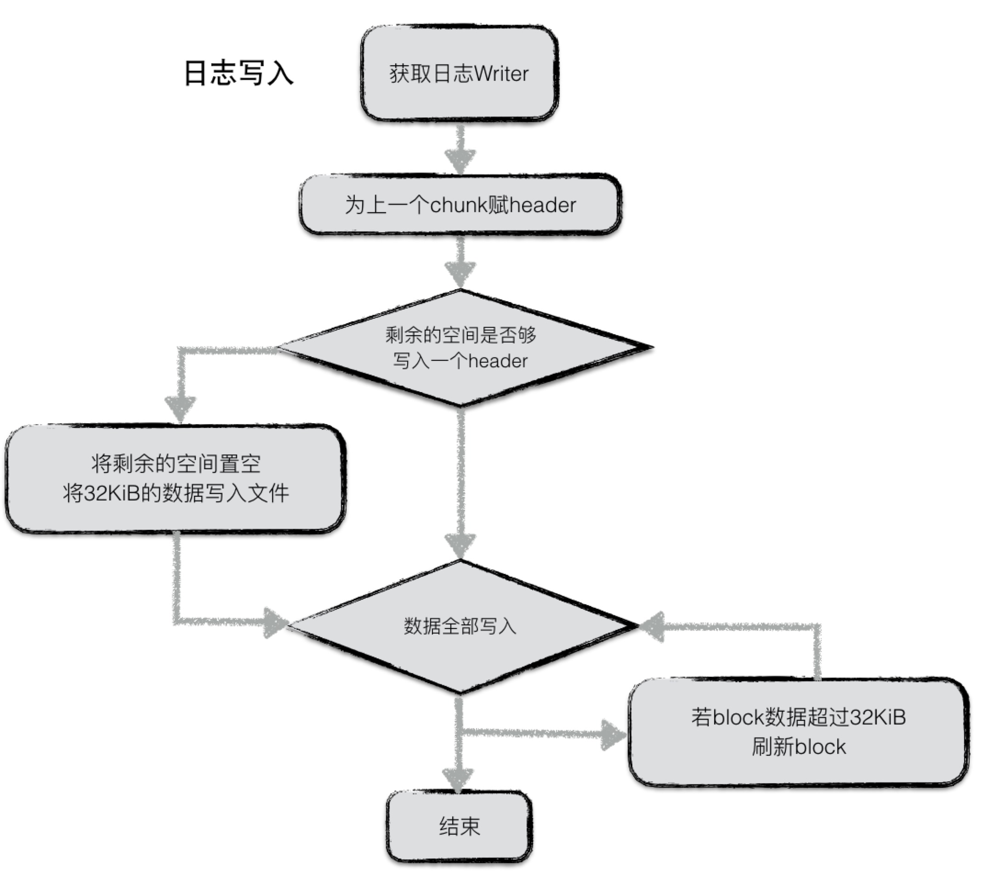

# 日志

为了防止写入内存的数据库因为进程异常、系统掉电等情况发生丢失，leveldb 在写内存之前会将本次写操作的内容写入日志文件中。

在 leveldb 中，有两个 memory db，以及对应的两份日志文件。其中一个 memory db 是可读写的，当这个 db 的数据量超过预定的上限时，便会转换成一个不可读的 memory db，与此同时，与之对应的日志文件也变成一份 frozen log。 

而新生成的 immutable memory db 则会由后台的 minor compaction 进程将其转换成一个 sstable 文件进行持久化，持久化完成，与之对应的 frozen log 被删除。

在本文中主要分析日志的结构、写入读取操作。

## 日志结构

为了增加读取效率，日志文件中按照 block 进行划分，每个 block 的大小为 32KiB。每个 block 中包含了若干个完整的 chunk。

一条日志记录包含一个或多个 chunk。每个 chunk 包含了一个 7 字节大小的 header，前 4 字节是该 chunk 的校验码，紧接的 2 字节是该 chunk 数据的长度，以及最后一个字节是该 chunk 的类型。其中 checksum 校验的范围包括 chunk 的类型以及随后的 data 数据。

chunk 共有四种类型：full，first，middle，last。一条日志记录若只包含一个 chunk，则该 chunk 的类型为 full。若一条日志记录包含多个 chunk，则这些 chunk 的第一个类型为 first，最后一个类型为 last，中间包含大于等于 0 个 middle 类型的 chunk。

由于一个 block 的大小为 32KiB，因此当一条日志文件过大时，会将第一部分数据写在第一个 block 中，且类型为 first，若剩余的数据仍然超过一个 block 的大小，则第二部分数据写在第二个 block 中，类型为 middle，最后剩余的数据写在最后一个 block 中，类型为 last。

## 日志内容

日志的内容为 **写入的batch编码后的信息**。

具体的格式为：

一条日志记录的内容包含：

- Header
- Data

其中 header 中有
1. 当前 db 的 sequence number
2. 本次日志记录中所包含的 put/del 操作的个数。

紧接着写入所有 batch 编码后的内容。有关 batch 的编码规则，可以见 [读写操作](../02-read-write/README.md).

## 日志写

日志写入流程较为简单，在 leveldb 内部，实现了一个 journal 的 writer。首先调用 `Next` 函数获取一个`singleWriter`，这个 `singleWriter` 的作用就是写入**一条journal记录**。

`singleWriter` 开始写入时，标志着第一个 chunk 开始写入。在写入的过程中，不断判断 writer 中 buffer 的大小，若超过 32KiB，将 chunk 开始到现在做为一个完整的 chunk，为其计算 header 之后将整个 block 写入文件。与此同时 reset
buffer，开始新的 chunk 的写入。

若一条 journal 记录较大，则可能会分成几个 chunk 存储在若干个 block 中。

## 日志读

同样，日志读取也较为简单。为了避免频繁的 IO 读取，每次从文件中读取数据时，按 block（32KiB）进行块读取。

每次读取一条日志记录，reader 调用 `Next` 函数返回一个 `singleReader`。`singleReader` 每次调用`Read`函数就返回一个 chunk 的数据。每次读取一个 chunk，都会检查这批数据的校验码、数据类型、数据长度等信息是否正确，若不正确，且用户要求严格的正确性，则返回错误，否则丢弃整个 chunk 的数据。

循环调用 `singleReader` 的 `read` 函数，直至读取到一个类型为 `Last` 的 chunk，表示整条日志记录都读取完毕，返回。
