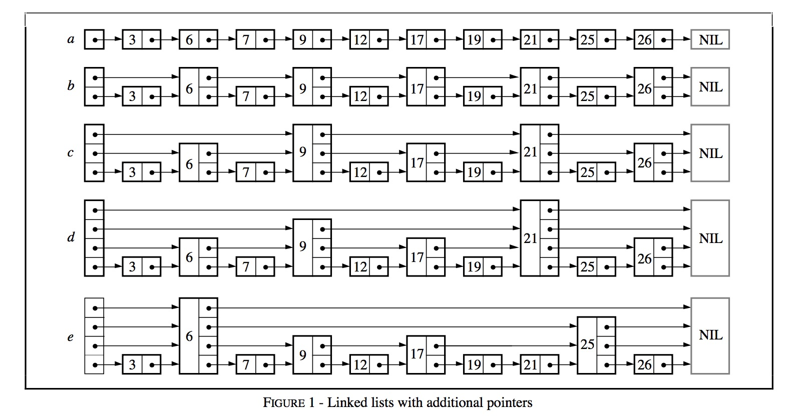
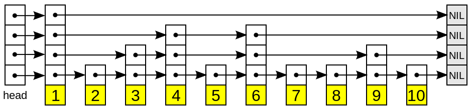
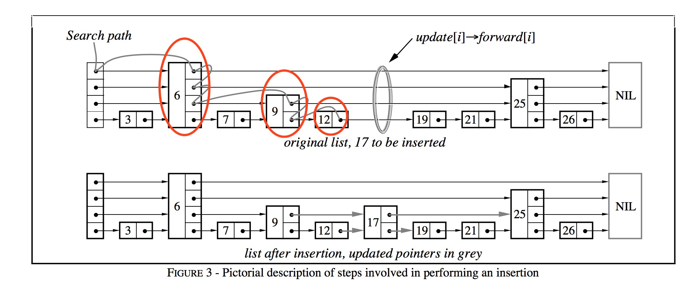

# 内存数据库

leveldb 中内存数据库用来维护有序的 key-value 对，其底层是利用跳表实现，绝大多数操作（读／写）的时间复杂度均为 `O(log
n)`，有着与平衡树相媲美的操作效率，但是从实现的角度来说简单许多，因此在本文中将介绍一下内存数据库的实现细节。

## 跳表

### 概述

跳表（SkipList）是由 William Pugh 提出的。他在论文[《Skip lists: a probabilistic alternative to balanced
trees》][1] 中详细地介绍了有关跳表结构、插入删除操作的细节。


这种数据结构是利用 **概率均衡** 技术，加快简化插入、删除操作，且保证绝大大多操作均拥有 `O(log n)` 的良好效率。

作者在他的论文中这样介绍跳表：

> Skip lists are a data structure that can be used in place of balanced trees.
> Skip lists use probabilistic balancing rather than strictly enforced balancing
> and as a result the algorithms for insertion and deletion in skip lists are
> much simpler and significantly faster than equivalent algorithms for
> balanced trees.

平衡树（以红黑树为代表）是一种非常复杂的数据结构，为了维持树结构的平衡，获取稳定的查询效率，平衡树每次插入可能会涉及到较为复杂的节点旋转等操作。作者设计跳表的目的就是借助 **概率平衡**，来构建一个快速且简单的数据结构，取代平衡树。



作者从链表讲起，一步步引出了跳表这种结构的由来。

结构 a 中，所有元素按序排列，被存储在一个链表中，则一次查询之多需要比较 N 个链表节点；

结构 b 中，每隔 2 个链表节点，新增一个额外的指针，该指针指向间距为 2 的下一个节点，如此以来，借助这些额外的指针，一次查询至多只需要 `⌈n/2⌉+1` 次比较；

结构 c 中，在图 b 的基础上，每隔 4 个链表节点，新增一个额外的指针，指向间距为 4 的下一个节点，一次查询至多需要 `⌈n/4⌉+2` 次比较；

作者推论，若每隔 `2^i` 个节点，新增一个辅助指针，最终一次节点的查询效率为 `O(log n)`。但是这样不断地新增指针，使得一次插入、删除操作将会变得非常复杂。

一个拥有 `k` 个指针的结点称为一个`k`层结点（*level k node*）。按照上面的逻辑，50% 的结点为 1 层节点，25% 的结点为 2 层节点，12.5% 的结点为 3 层节点。若保证每层节点的分布如上述概率所示，则仍然能够相同的查询效率。结构 e 便是一个示例。 
维护这些辅助指针将会带来较大的复杂度，因此作者将每一层中，每个节点的辅助指针指向该层中下一个节点。故在插入删除操作时，只需跟操作链表一样，修改相关的前后两个节点的内容即可完成，作者将这种数据结构称为跳表。

### 结构



一个跳表的结构示意图如上所示。

跳跃列表是按层建造的。底层是一个普通的\ **有序**\ 链表。每个更高层都充当下面链表的"快速通道"，这里在层 *i* 中的元素按某个固定的概率 *p* (通常为 0.5 或 0.25 )出现在层 `i+1` 中。平均起来，每个元素都在 `1/(1-p)` 个列表中出现，而最高层的元素（通常是在跳跃列表前端的一个特殊的头元素）在 `O(log1/p n)` 个列表中出现。

### 查找


在介绍插入和删除操作之前，我们首先介绍查找操作，该操作是上述两个操作的基础。

例如图中，需要查找一个值为 17 的链表节点，查找的过程为：

-  首先根据跳表的高度选取最高层的头节点；
-  若跳表中的节点内容小于查找节点的内容，则取该层的下一个节点继续比较；
-  若跳表中的节点内容等于查找节点的内容，则直接返回；
-  若跳表中的节点内容大于查找节点的内容，且层高不为 0，则降低层高，且从前一个节点开始，重新查找低一层中的节点信息；若层高为 0，则返回当前节点，该节点的key大于所查找节点的key。

综合来说，就是利用稀疏的高层节点，快速定位到所需要查找节点的大致位置，再利用密集的底层节点，具体比较节点的内容。

### 插入

插入操作借助于查找操作实现。



-  在查找的过程中，不断记录 **每一层** 的 **前任节点**，如图中红色圆圈所表示的；
-  为新插入的节点随机产生层高（随机产生层高的算法较为简单，依赖最高层数和概率值 `p`，可见下文中的代码实现）；
-  在合适的位置插入新节点（例如图中节点 12 与节点 19 之间），并依据查找时记录的前任节点信息，在每一层中，**以链表插入** 的方式，将该节点插入到每一层的链接中。

**链表插入** 指：将当前节点的 `Next` 值置为前任节点的 `Next` 值，将前任节点的 `Next` 值替换为当前节点。

```go
func (p *DB) randHeight() (h int) {
   const branching = 4
   h = 1
   for h < tMaxHeight && p.rnd.Int()%branching == 0 {
      h++
   }
   return
}
```

### 删除

跳表的删除操作较为简单，依赖查找过程找到该节点在整个跳表中的位置后，**以链表删除** 的方式，在每一层中，删除该节点的信息。

**链表删除** 指：将前任节点的 `Next` 值替换为当前节点的 `Next` 值，并将当前节点所占的资源释放。

### 迭代

#### 向后遍历

-  若迭代器刚被创建，则根据用户指定的查找范围 `[Start, Limit)` 找到一个符合条件的跳表节点；
-  若迭代器处于中部，则取出上一次访问的跳表节点的后继节点，作为本次访问的跳表节点（后继节点为最底层的后继节点）；
-  利用跳表节点信息（`keyvalue` 数据偏移量，`key`，`value` 值长度等），获取 `keyvalue`数据；

#### 向前遍历

-  若迭代器刚被创建，则根据用户指定的查找范围 `[Start, Limit）` 在跳表中找到最后一个符合条件的跳表节点；
-  若迭代器处于中部，则利用上一次访问的节点的 `key` 值，查找比该 `key` 值更小的跳表节点；
-  利用跳表节点信息（ `keyvalue` 数据偏移量，`key`，`value` 值长度等），获取 `keyvalue` 数据；

## 内存数据库

在介绍完跳表这种数据结构的组织原理以后，我们介绍 leveldb 如何利用跳表来构建一个高效的内存数据库。

### 键值编码

在介绍内存数据库之前，首先介绍一下内存数据库的键值编码规则。由于内存数据库本质是一个 kv 集合，且所有的数据项都是依据 key 值排序的，因此键值的编码规则尤为关键。

内存数据库中，key 称为 internalKey，其由三部分组成：

-  用户定义的 key：这个 key 值也就是原生的 key 值；
-  序列号：leveldb 中，每一次写操作都有一个 sequence number，标志着写入操作的先后顺序。由于在 leveldb 中，可能会有多条相同key的数据项同时存储在数据库中，因此需要有一个序列号来标识这些数据项的新旧情况。序列号最大的数据项为最新值；
-  类型：标志本条数据项的类型，为更新还是删除；

| uKey | sequence number (7 bytes) | type (1 byte) |
| ---- | ------------------------- | ------------- |

### 键值比较

内存数据库中所有的数据项都是按照键值比较规则进行排序的。这个比较规则可以由用户自己定制，也可以使用系统默认的。在这里介绍一下系统默认的比较规则。

默认的比较规则：

-  首先按照字典序比较用户定义的 key（`ukey`），若用户定义 key 值大，整个 internalKey 就大；
-  若用户定义的 key 相同，则序列号大的 internalKey 值就小；

通过这样的比较规则，则所有的数据项首先按照用户 key 进行升序排列；当用户 key 一致时，按照序列号进行降序排列，这样可以保证首先读到序列号大的数据项。

### 数据组织

以 goleveldb 为示例，内存数据库的定义如下：

```go
type DB struct {
   cmp comparer.BasicComparer
   rnd *rand.Rand

   mu     sync.RWMutex
   kvData []byte
   // Node data:
   // [0]         : KV offset
   // [1]         : Key length
   // [2]         : Value length
   // [3]         : Height
   // [3..height] : Next nodes
   nodeData  []int
   prevNode  [tMaxHeight]int
   maxHeight int
   n         int
   kvSize    int
}
```

其中 kvData 用来存储每一条数据项的 key-value 数据，nodeData 用来存储每个跳表节点的 **链接信息**。

nodeData 中，每个跳表节点占用一段连续的存储空间，每一个字节分别用来存储特定的跳表节点信息。

-  第一个元素用来存储本节点 key-value 数据在 kvData 中对应的偏移量；
-  第二个元素用来存储本节点 key 值长度；
-  第三个元素用来存储本节点 value 值长度；
-  第四个元素用来存储本节点的层高；
-  第五个元素开始，用来存储每一层对应的下一个节点的索引值；

### 基本操作

- Put
- Get
- Delete
- Iterator

这些操作均依赖于底层的跳表的基本操作实现，不再赘述。

[1]: https://15721.courses.cs.cmu.edu/spring2018/papers/08-oltpindexes1/pugh-skiplists-cacm1990.pdf
