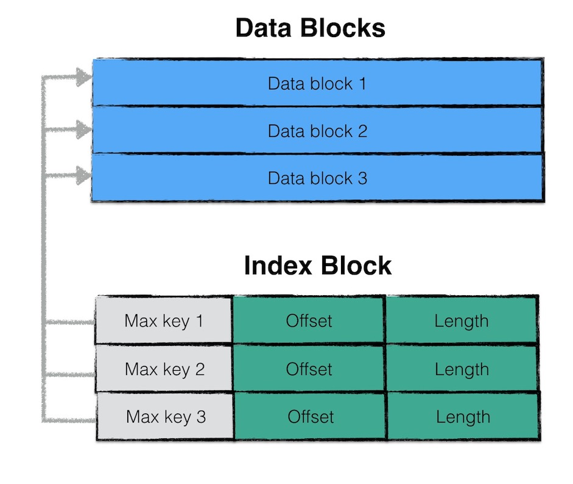
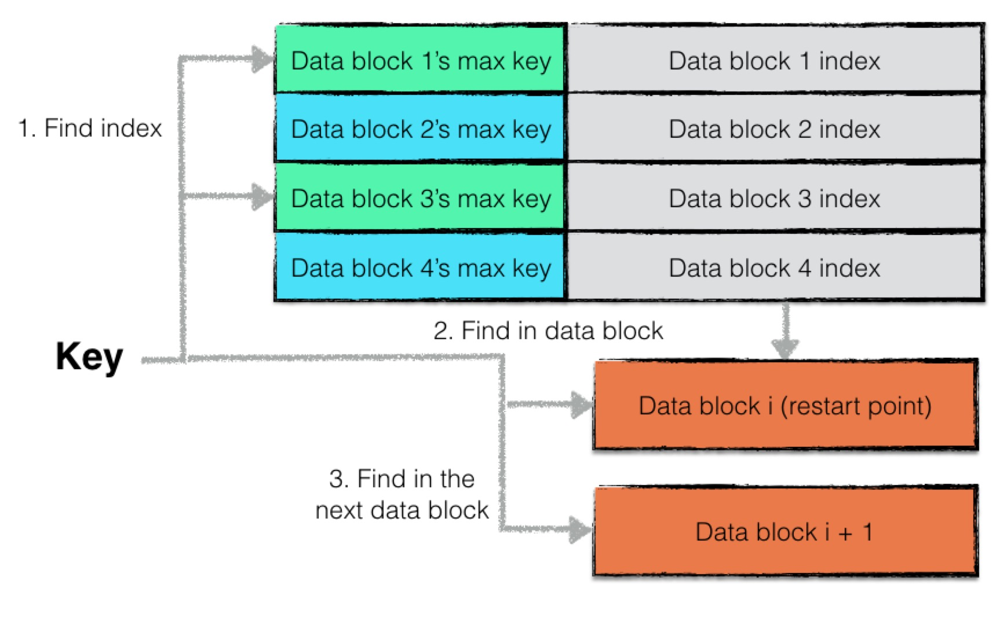

# SSTable

## 概述

如我们之前提到的，LevelDB 是典型的 LSM 树（Log Structured-Merge Tree）实现，即一次 LevelDB 的写入过程并不是直接将数据持久化到磁盘文件中，而是将写操作首先写入日志文件中，其次将写操作应用在 memtable 上。

当 LevelDB 达到 checkpoint 点（memtable 中的数据量超过了预设的阈值），会将当前 memtable 冻结成一个不可更改的内存数据库（immutable memory db），并且创建一个新的 memtable 供系统继续使用。

immutable memory db 会在后台进行一次 minor compaction，即将内存数据库中的数据持久化到磁盘文件中。

> **注解**  
> 在这里我们暂时不展开讨论 minor compaction 相关的内容，读者可以简单地理解为将内存中的数据持久化到文件

LevelDB（或者说 LSM 树）设计 Minor Compaction 的目的是为了：

1. 有效地降低内存的使用率；
2. 避免日志文件过大，系统恢复时间过长；

当 memory db 的数据被持久化到文件中时，LevelDB 将以一定规则进行文件组织，这种文件格式称为 SSTable。在本文中将详细地介绍 SSTable 的文件格式以及相关读写操作。 

## SSTable 文件格式

### 物理结构

为了提高整体的读写效率，一个 SSTable 文件按照固定大小进行**块**（block）划分，默认每个块的大小为 4KiB。除了存储数据以外，每个块还会存储两个额外的辅助字段：

1. **压缩类型**：说明块中存储的数据是否进行了数据压缩，若是，采用了哪种算法进行压缩。LevelDB 中默认采用 [Snappy 算法](https://github.com/google/snappy) 进行压缩
2. **CRC 校验码**： 循环冗余校验码，校验范围包括**数据**以及**压缩类型**


### 逻辑结构

在逻辑上，根据功能不同，LevelDB 在逻辑上又将 SSTable 的块分为：

|                 类型 | 作用                                                                                                                   |
| -------------------: | :--------------------------------------------------------------------------------------------------------------------- |
|       **data block** | 存储 key/value 数据对                                                                                                  |
|     **filter block** | 用来存储一些过滤器相关的数据（布隆过滤器），但是若用户不指定 LevelDB 使用过滤器，LevelDB 在该 block 中不会存储任何内容 |
| **meta index block** | 用来存储 filter block 的索引信息（索引信息指在该 SSTable 文件中的偏移量以及数据长度）                                  |
|      **index block** | 存储每个 data block 的索引信息                                                                                         |
|           **footer** | 用来存储 meta index block 及 index block 的索引信息；                                                                  |


注意，除了 footer 类型以外，其他类型的块物理结构都是如 物理结构 节所示，每个块都会有自己的压缩信息以及 CRC 校验码信息。

## data block 结构

data block 中存储的数据是 LevelDB 中的 key/value 键值对。其中一个 data block 中的数据部分（不包括压缩类型、CRC校验码）按逻辑又以下图进行划分：


第一部分用来存储 key/value 数据。由于 SSTable 中所有的 key/value 对都是严格按序存储的，用了节省存储空间，LevelDB 并不会为每一对 key/value 对都存储完整的 key 值，而是存储与**上一个 key 非共享的后缀部分**，避免了 key 重复内容的存储。

每间隔若干个 key/value 对，将为该条记录重新存储一个完整的 key。重复该过程（默认间隔值为 16），每个重新存储完整 key 的点称之为 Restart Point。

> **注解**
> 
> LevelDB 设计 Restart Point 的目的是在读取 SSTable 内容时，加速查找的过程。
> 由于每个 Restart Point 存储的都是完整的 key 值，因此在 SSTable 中进行数据查找时，可以首先利用 Restart Point 点的数据进行键值比较，以便于快速定位目标数据所在的区域；
> 当确定目标数据所在区域时，再依次对区间内所有数据项逐项比较 key 值，进行细粒度地查找；
> 该思想有点类似于跳表中利用高层数据迅速定位，底层数据详细查找的理念，降低查找的复杂度。

每个数据项的格式如下图所示：


一个 entry 分为 5 部分内容：

1. 与前一条记录 key 共享部分的长度；
2. 与前一条记录 key 不共享部分的长度；
3. value 长度；
4. 与前一条记录 key 非共享的内容；
5. value 内容；

例如：

```text
restart_interval=2
entry one  : key=deck,value=v1
entry two  : key=dock,value=v2
entry three: key=duck,value=v3  
```

```text
 + restart point (offset=0)                                                 + restart point (offset=16)
     /                                                                          /
    +-----+-----+-----+----------+--------+-----+-----+-----+---------+--------+-----+-----+-----+----------+--------+
    |  0  |  4  |  2  |  "deck"  |  "v1"  |  1  |  3  |  2  |  "ock"  |  "v2"  |  0  |  4  |  2  |  "duck"  |  "v3"  |
    +-----+-----+-----+----------+--------+-----+-----+-----+---------+--------+-----+-----+-----+----------+--------+
     \                                   / \                                  / \                                   /
      +----------- entry one -----------+   +----------- entry two ----------+   +---------- entry three ----------+
```

三组 entry 按上图的格式进行存储。值得注意的是 `restart_interval` 为 2，因此每隔两个 entry 都会有一条数据作为 Restart Point 点的数据项，存储完整 key 值。因此 entry three 存储了完整的 key。

此外，第一个 Restart Point 为 0（偏移量），第二个 Restart Point 为 16，Restart Point 共有两个，因此一个 data block 数据段的末尾添加了下图所示的数据：

```text
+------------+-----------+--------+
|     0      |    16     |   2    |
+------------+-----------+---+----+
 \                      /     \
  +-- restart points --+       + restart points length
```

尾部数据记录了每一个 Restart Point 的值，以及所有 Restart Point 的个数。

## filter block 结构

讲完了 data block，在这一章节将展开讲述 filter block 的结构。

为了加快 SSTable 中数据查询的效率，在直接查询 data block 中的内容之前，LevelDB 首先根据 filter block 中的过滤数据判断指定的 data block 中是否有需要查询的数据，若判断不存在，则无需对这个 data block 进行数据查找。

filter block 存储的是 data block 数据的一些过滤信息。这些过滤数据一般指代布隆过滤器的数据，用于加快查询的速度，关于布隆过滤器的详细内容参见 [布隆过滤器][bloom-filter]。


filter block 存储的数据主要可以分为两部分：
1. 过滤数据
2. 索引数据

其中索引数据中，`filter i offset` 表示第 i 个 filter data 在整个 filter
block 中的起始偏移量，`filter offset's offset`表示 filter block 的索引数据在 filter block 中的偏移量。

在读取 filter block 中的内容时，可以首先读出`filter offset's offset`的值，然后依次读取`filter i offset`，根据这些 offset 分别读出`filter data`。

Base Lg 默认值为 11，表示每 2KB 的数据，创建一个新的过滤器来存放过滤数据。

一个 SSTable 只有一个 filter block，其内存储了所有 block 的 filter 数据。具体来说，`filter_data_k` 包含了所有起始位置处于 `[base*k, base*(k+1)]`范围内 block 的 key 集合的 filter 数据，按数据大小而非 block 切分主要是为了尽量均匀，以应对存在一些 block 的 key 很多，另一些 block 的 key 很少的情况。

> **注解**  
> LevelDB 中，特殊的 SSTable 文件格式设计简化了许多操作，例如：
> 索引和布隆过滤器等元数据可随文件一起创建和销毁，即直接存在文件里，不用加载时动态计算，不用维护更新

## meta index block 结构

meta index block 用来存储 filter block 在整个 SSTable 中的索引信息。

meta index block 只存储一条记录：

- key 为："`filter.`" 与过滤器名字组成的常量字符串
- value 为：filter block 在 SSTable 中的索引信息序列化后的内容，索引信息包括：
   1. 在 SSTable 中的偏移量
   2. 数据长度

## index block 结构

与 meta index block 类似，index block 用来存储所有 data block 的相关索引信息。

index block 包含若干条记录，每一条记录代表一个 data block 的索引信息。

一条索引包括以下内容：

1. data block i 中最大的 key 值；
2. 该 data block 起始地址在 SSTable 中的偏移量；
3. 该 data block 的大小；



> **注解**  
> data block i 最大的 key 值还是 index block 中该条记录的 key 值。
> 如此设计的目的是，依次比较 index block 中记录信息的 key 值即可实现快速定位目标数据在哪个 data block 中。 

## footer 结构

footer 大小固定，为 48 字节，用来存储 meta index block 与 index block 在SSTable 中的索引信息，另外尾部还会存储一个 magic word，内容为："http://code.google.com/p/LevelDB/" 字符串 SHA1 哈希的前 8 个字节。


## 读写操作

在介绍完 SSTable 文件具体的组织方式之后，我们再来介绍一下相关的读写操作。为了便于读者理解，将首先介绍写操作。

### 写操作

SSTable 的写操作通常发生在：

- memory db 将内容持久化到磁盘文件中时，会创建一个 SSTable 进行写入；
- LevelDB 后台进行文件 compaction 时，会将若干个 SSTable 文件的内容重新组织，输出到若干个新的 SSTable 文件；

对 SSTable 进行写操作的数据结构为 [`tWriter`][tWriter]，具体定义如下：

```go
// tWriter wraps the table writer. It keep track of file descriptor
// and added key range.
type tWriter struct {
   t *tOps

   fd storage.FileDesc // 文件描述符
   w  storage.Writer   // 文件系统 writer
   tw *table.Writer

   first, last []byte
}
```

主要包括了一个 SSTable 的文件描述符 `fd`，底层文件系统的 writer `w`，该 SSTable 中所有数据项最大（`first`）最小（`last`）的 key 值以及一个的 `table.Writer` `tw`。

一次 SSTable 的写入为一次不断利用迭代器读取需要写入的数据，并不断调用 [`tw.Append`][table-Writer-Append] 方法，直至全部有效数据写入完毕，为该 SSTable 文件附上元数据的过程。

该迭代器可以是一个内存数据库的迭代器，写入情景对应着上述的第一种情况；

该迭代器也可以是一个 SSTable 文件的迭代器，写入情景对应着上述的第二种情况；

> **注解**  
> SSTable 的元数据包括：
> 1. 文件编码
> 2. 大小
> 3. 最大 key 值
> 4. 最小 key 值

故，理解 `table.Writer.Append` 方法是理解整个写入过程的关键。

#### [table.Writer][table-Writer]

在介绍 `Append` 方法之前，首先介绍一下 `table.Writer` 这个数据结构。主要的定义如下：

```go
// Writer is a table writer.
type Writer struct {
   writer io.Writer
   // Options
   blockSize   int // 默认是 4KiB

   dataBlock   blockWriter // data 块 Writer
   indexBlock  blockWriter // index 块 Writer
   filterBlock filterWriter // filter 块 Writer
   pendingBH   blockHandle 
   offset      uint64
   nEntries    int // key-value 键值对个数
}
```

其中 `blockWriter` 与 `filterWriter` 表示底层的两种不同的 writer，`blockWriter` 负责 data 数据的写入，而 `filterWriter` 负责过滤数据的写入。

`pendingBH` 记录了上一个 data block 的索引信息，当下一个 data block 的数据开始写入时，将该索引信息写入 indexBlock 中。

#### [Append][table-Writer-Append]

一次 `Append` 方法的主要逻辑如下：

1. 若本次写入为新 data block 的第一次写入，则将上一个 data block 的索引信息写入
2. 将 key/value 数据写入 `dataBlock`
3. 将过滤信息写入 `filterBlock`
4. 若 `dataBlock` 中的数据超过预定上限，则标志着本次 dataBlock 写入结束，将内容刷新到磁盘文件中

```go
func (w *Writer) Append(key, value []byte) error {
   // ...

   w.flushPendingBH(key)
   // Append key/value pair to the data block.
   w.dataBlock.append(key, value)
   // Add key to the filter block.
   w.filterBlock.add(key)

   // Finish the data block if block size target reached.
   if w.dataBlock.bytesLen() >= w.blockSize {
      if err := w.finishBlock(); err != nil {
            w.err = err
            return w.err
      }
   }
   w.nEntries++
   return nil
}
```

#### [dataBlock.append][table-blockWriter-append]

该函数将编码后的 kv 数据写入到 dataBlock 对应的 buffer 中，编码的格式如上文中提到的数据项格式。此外，在写入的过程中，若该数据项为 Restart Point，则会添加相应的 Restart Point 信息。 

#### [filterBlock.add][table-filterWriter-add]

该函数将 kv 数据项的 key 值加入到过滤信息中，具体可见 [布隆过滤器][bloom-filter]

#### [finishBlock][table-Writer-finishBlock]

若一个 data block 中的数据超过了固定上限，则需要将相关数据写入到磁盘文件中。

在写入时，需要做以下工作：

1. 封装 dataBlock，记录 Restart Point 的个数；
2. 若 dataBlock 的数据需要进行压缩（例如 snappy 压缩算法），则对 dataBlock 的数据进行压缩；
3. 计算 checksum；
4. 封装 dataBlock 索引信息（offset，length）；
5. 将 dataBlock 的 buffer 中的数据写入磁盘文件；
6. 利用这段时间里维护的过滤信息生成过滤数据，放入 `filterBlock` 对应的 buffer 中；

#### [Close][table-Writer-Close]

当迭代器取出所有数据并完成写入后，调用 `table.Writer` 的 `Close` 函数完成最后的收尾工作：

1. 若 buffer 中仍有未写入的数据，封装成一个 data block 写入；
2. 将 `filterBlock` 的内容写入磁盘文件；
3. 将 `filterBlock` 的索引信息写入 `metaIndexBlock` 中，写入到磁盘文件；
4. 写入 `indexBlock` 的数据；
5. 写入 `footer` 数据；

至此为止，所有的数据已经被写入到一个 SSTable 中了，由于**一个 SSTable 是作为一个 memory db 或者 Compaction 的结果原子性落地的**，因此在 SSTable 写入完成之后，将进行更为复杂的**LevelDB 的版本更新**，将在接下来的文章中继续介绍。

## 读操作

读操作是写操作的逆过程，充分理解了写操作，将会帮助理解读操作。

下图为在一个 SSTable 中查找某个数据项的流程图：


大致流程为：

1. 首先判断“文件句柄” cache 中是否有指定 SSTable 文件的文件句柄，若存在，则直接使用 cache 中的句柄；否则打开该 SSTable 文件，**按规则读取该文件的元数据**，将新打开的句柄存储至 cache 中；
2. 利用 SSTable 中的 index block 进行快速的数据项位置定位，得到该数据项有可能存在的**两个** data block；
3. 利用 index block 中的索引信息，首先打开第一个可能的 data block；
4. 利用 filter block 中的过滤信息，判断指定的数据项是否存在于该 data block 中，若存在，则创建一个迭代器对 data block 中的数据进行迭代遍历，寻找数据项；若不存在，则结束该 data block 的查找；
5. 若在第一个 data block 中找到了目标数据，则返回结果；若未查找成功，则打开第二个 data block，重复步骤 4；
6. 若在第二个 data block 中找到了目标数据，则返回结果；若未查找成功，则返回 `Not Found` 错误信息；

### 缓存

在 LevelDB 中，使用 cache 来缓存两类数据：

- SSTable 文件句柄及其元数据；
- data block 中的数据；

因此在打开文件之前，首先判断能够在 cache 中命中 SSTable 的文件句柄，避免重复读取的开销。

### 元数据读取


由于 SSTable 复杂的文件组织格式，因此在打开文件后，需要读取必要的元数据，才能访问 SSTable 中的数据。

元数据读取的过程可以分为以下几个步骤：

1. 读取文件的最后 48 字节的利用，即**Footer**数据；
2. 读取 Footer 数据中维护的以下两个部分的索引信息并记录，以提高整体的查询效率；
   1. Meta Index Block
   2. Index Block 
3. 利用 Meta Index Block 的索引信息读取该部分的内容；
4. 遍历 Meta Index Block，查看是否存在“有用”的 filter block 的索引信息，若有，则记录该索引信息；若没有，则表示当前 SSTable 中不存在任何过滤信息来提高查询效率；

### 数据项的快速定位

SSTable 中存在多个 data block，倘若依次进行“遍历”显然是不可取的。但是由于一个 SSTable 中所有的数据项都是按序排列的，因此可以利用有序性已经 index block 中维护的索引信息快速定位目标数据项可能存在的 data block。

一个 index block 的文件结构示意图如下：


index block 是由一系列的键值对组成，每一个键值对表示一个 data block 的索引信息。

键值对的 key 为该 data block 中数据项 key 的最大值，value 为该 data block 的索引信息（offset, length）。

因此若需要查找目标数据项，仅仅需要依次比较 index block 中的这些索引信息，倘若目标数据项的 key 大于某个 data block 中最大的 key 值，则该 data block 中必然不存在目标数据项。故通过这个步骤的优化，可以直接确定目标数据项落在哪个 data block 的范围区间内。

> **注解**  
> 值得注意的是，与 data block 一样，index block 中的索引信息同样也进行了 key 值截取，即第二个索引信息的 key 并不是存储完整的 key，而是存储与前一个索引信息的 key 不共享的部分，区别在于 data block 中这种范围的划分粒度为 16，而 index block 中为 2。
> 也就是说，index block 连续两条索引信息会被作为一个最小的“比较单元“，在查找的过程中，若第一个索引信息的 key 小于目标数据项的 key，则紧接着会比较第三条索引信息的 key。
> 这就导致最终目标数据项的范围区间为某”两个“ data block。



### 过滤 data block

若 SSTable 存有每一个 data block 的过滤数据，则可以利用这些过滤数据对 data block 中的内容进行判断，“确定”目标数据是否存在于 data block 中。

过滤的原理为：

- 若过滤数据显示目标数据不存在于 data block 中，则目标数据**一定不**存在于 data block 中；
- 若过滤数据显示目标数据存在于 data block 中，则目标数据**可能存在**于 data block 中；

具体的原理可能参见[布隆过滤器][bloom-filter]。

因此利用过滤数据可以过滤掉部分 data block，避免发生无谓的查找。

### 查找 data block


在 data block 中查找目标数据项是一个简单的迭代遍历过程。虽然 data block 中所有数据项都是有序的，但是作者并没有采用“二分查找”来提高查找的效率，而是使用了更大的查找单元进行快速定位。

与 index block 的查找类似，data block 中，以 16 条记录为一个查找单元，若 entry 1 的 key 小于目标数据项的 key，则下一条比较的是 entry 17。

因此查找的过程中，利用更大的查找单元快速定位目标数据项可能存在于哪个区间内，之后依次比较判断其是否存在与 data block 中。

可以看到，SSTable 很多文件格式设计（例如 Restart Point，index block，filter block，max key）在查找的过程中，都极大地提升了整体的查找效率。

## 文件特点

### 只读性

SSTable 文件为 compaction 的结果原子性的产生，在其余时间是只读的。

### 完整性

一个 SSTable 文件，其辅助数据：

- 索引数据
- 过滤数据

**都直接存储于同一个文件中**。当读取需要使用这些辅助数据时，无须额外的磁盘读取；当 SSTable 文件需要删除时，无须额外的数据删除。简要地说，辅助数据随着文件一起创建和销毁。

### 并发访问友好性

由于 SSTable 文件具有只读性，因此不存在同一个文件的读写冲突。

LevelDB 采用引用计数维护每个文件的引用情况，当一个文件的计数值大于 0 时，对此文件的删除动作会等到该文件被释放时才进行，因此实现了无锁情况下的并发访问。

### Cache 一致性

SSTable 文件为只读的，因此 cache 中的数据永远于 SSTable 文件中的数据保持一致。

[bloom-filter]: ../07-bloom-filter/README.md
[table-Writer-Append]: https://github.com/sammyne/goleveldb/blob/master/leveldb/table/writer.go#L237
[table-blockWriter-append]: https://github.com/sammyne/goleveldb/blob/master/leveldb/table/writer.go#L43
[table-filterWriter-add]: https://github.com/sammyne/goleveldb/blob/master/leveldb/table/writer.go#L94
[table-Writer]: https://github.com/sammyne/goleveldb/blob/master/leveldb/table/writer.go#L139
[table-Writer-Close]: https://github.com/sammyne/goleveldb/blob/master/leveldb/table/writer.go#L286
[table-Writer-finishBlock]: https://github.com/sammyne/goleveldb/blob/master/leveldb/table/writer.go#L219
[tWriter]: https://github.com/sammyne/goleveldb/blob/master/leveldb/table.go#L543