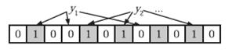

# 布隆过滤器

Bloom Filter 是一种空间效率很高的随机数据结构，它利用位数组很简洁地表示一个集合，并能判断一个元素是否属于这个集合。Bloom Filter 的这种高效是有一定代价的：在判断一个元素是否属于某个集合时，有可能会把不属于这个集合的元素误认为属于这个集合（false positive）。因此，Bloom Filter 不适合那些“零错误”的应用场合。而在能容忍低错误率的应用场合下，Bloom Filter 通过极少的错误换取了存储空间的极大节省。

leveldb 中利用布隆过滤器判断指定的key值是否存在于 sstable 中，若过滤器表示不存在，则该 key 一定不存在，由此加快了查找的效率。

## 结构

bloom 过滤器底层是一个位数组，初始时每一位都是 0


当插入值 `x` 后，分别利用 `k` 个哈希函数（图中为 3）利用 `x` 的值进行散列，并将散列得到的值与 bloom 过滤器的容量进行取余，将取余结果所代表的那一位值置为 1。


一次查找过程与一次插入过程类似，同样利用 `k` 个哈希函数对所需要查找的值进行散列，只有散列得到的每一个位的值均为 1，才表示该值**有可能**正存在；反之若有任意一位的值为 0，则表示该值一定不存在。例如 `y1` 一定不存在；而 `y2` 可能存在。



## 数学结论

[文章][1] 从数学的角度阐述了布隆过滤器的原理，以及一系列的数学结论。

首先，与布隆过滤器准确率有关的参数有：

- 哈希函数的个数 `k`；
- 布隆过滤器位数组的容量 `m`;
- 布隆过滤器插入的数据数量 `n`;

主要的数学结论有：

1. 为了获得最优的准确率，当 `k = ln2 * (m/n)` 时，布隆过滤器获得最优的准确性；
2. 在哈希函数的个数取到最优时，要让错误率不超过 `є`，`m` 至少需要取到最小值的 1.44 倍；

## 实现

leveldb 中的布隆过滤器实现较为简单，以 goleveldb 为例，有关的代码在 filter/bloom.go 中。

定义如下，bloom 过滤器只是一个 `int` 数字。

```go
type bloomFilter int
```

创建一个布隆过滤器时，只需要指定为每个 key 分配的位数即可，如结论 2 所示，只要该值 `(m/n)` 大于 1.44 即可，一般可以取 10。

```go
func NewBloomFilter(bitsPerKey int) Filter {
    return bloomFilter(bitsPerKey)
}
```

创建一个 generator，这一步中需要指定哈希函数的个数`k`，可以看到`k = f * ln2`，而`f = m/n`，即数学结论 1。

返回的 generator 中可以添加新的 key 信息，调用 `Generate` 函数时，将所有的 key 构建成一个位数组写在指定的位置。

```go
func (f bloomFilter) NewGenerator() FilterGenerator {
    // Round down to reduce probing cost a little bit.
    k := uint8(f * 69 / 100) // 0.69 =~ ln(2)
    if k < 1 {
        k = 1
    } else if k > 30 {
        k = 30
    }
    return &bloomFilterGenerator{
        n: int(f),
        k: k,
    }
}
```

generator 主要有两个函数：

1. `Add`
2. `Generate`

`Add` 函数中，只是简单地将 key 的哈希散列值存储在一个整型数组中

```go
func (g *bloomFilterGenerator) Add(key []byte) {
    // Use double-hashing to generate a sequence of hash values.
    // See analysis in [Kirsch,Mitzenmacher 2006].
    g.keyHashes = append(g.keyHashes, bloomHash(key))
}
```

`Generate` 函数中，将之前一段时间内所有添加的 key 信息用来构建一个位数组，该位数组中包含了所有 key 的存在信息。

位数组的大小为用户指定的每个 key 所分配的位数 乘以 key 的个数。

位数组的最末尾用来存储k的大小。

```go
func (g *bloomFilterGenerator) Generate(b Buffer) {
    // Compute bloom filter size (in both bits and bytes)
    // len(g.keyHashes) 可以理解为n， g.n可以理解为m/n
    // nBits可以理解为m
    nBits := uint32(len(g.keyHashes) * g.n)
    // For small n, we can see a very high false positive rate.  Fix it
    // by enforcing a minimum bloom filter length.
    if nBits < 64 {
        nBits = 64
    }
    nBytes := (nBits + 7) / 8
    nBits = nBytes * 8

    dest := b.Alloc(int(nBytes) + 1)
    dest[nBytes] = g.k

    for _, kh := range g.keyHashes {
        // Double Hashing
        delta := (kh >> 17) | (kh << 15) // Rotate right 17 bits
        for j := uint8(0); j < g.k; j++ {
            bitpos := kh % nBits
            dest[bitpos/8] |= (1 << (bitpos % 8))
            kh += delta
        }
    }

    g.keyHashes = g.keyHashes[:0]
}
```

`Contain` 函数用来判断指定的 key 是否存在。

```go
func (f bloomFilter) Contains(filter, key []byte) bool {
    nBytes := len(filter) - 1
    if nBytes < 1 {
        return false
    }
    nBits := uint32(nBytes * 8)

    // Use the encoded k so that we can read filters generated by
    // bloom filters created using different parameters.
    k := filter[nBytes]
    if k > 30 {
        // Reserved for potentially new encodings for short bloom filters.
        // Consider it a match.
        return true
    }

    kh := bloomHash(key)
    delta := (kh >> 17) | (kh << 15) // Rotate right 17 bits
    for j := uint8(0); j < k; j++ {
        bitpos := kh % nBits
        if (uint32(filter[bitpos/8]) & (1 << (bitpos % 8))) == 0 {
            return false
        }
        kh += delta
    }
    return true
}
```

## 参考文献
- \[1\] [http://blog.csdn.net/jiaomeng/article/details/1495500][1]
- \[2\] [https://en.wikipedia.org/wiki/Double_hashing][2]

[1]: http://blog.csdn.net/jiaomeng/article/details/1495500
[2]: https://en.wikipedia.org/wiki/Double_hashing
