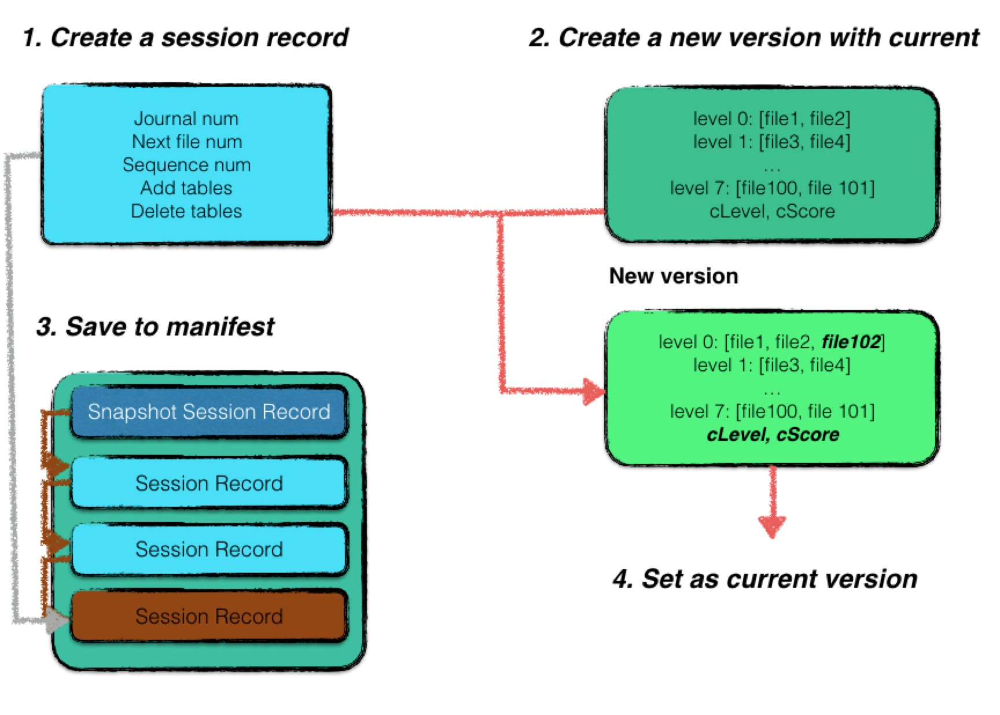
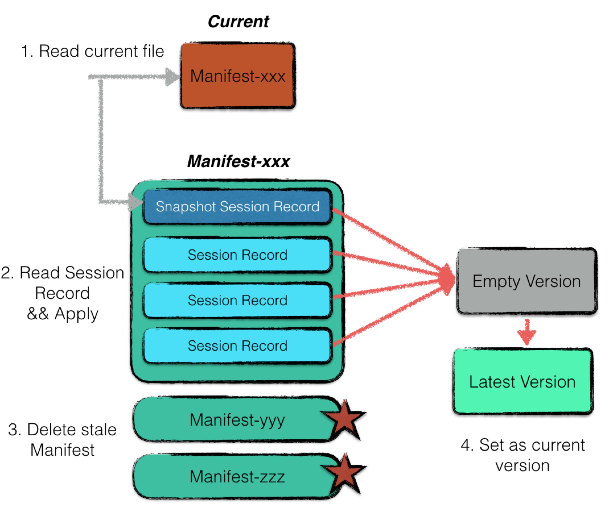

# 版本控制

Leveldb 每次新生成 sstable 文件，或者删除 sstable 文件，都会从一个版本升级成另外一个版本。

换句话说，每次 sstable 文件的更替对于 leveldb 来说是一个最小的操作单元，具有原子性。

版本控制对于 leveldb 来说至关重要，是保障数据正确性的重要机制。在本文中，将着重从版本数据的格式以及版本升级的过程进行展开。

## Manifest

manifest 文件专用于记录版本信息。leveldb 采用了增量式的存储方式，记录每一个版本相较于上一个版本的变化情况。

展开来说，一个 Manifest 文件中，包含了多条 Session Record。一个 Session Record 记录了从上一个版本至该版本的变化情况。

> **注解**
> 变化情况大致包括：
> 1. 新增了哪些 sstable 文件；
> 2. 删除了哪些 sstable 文件（由于 compaction 导致）；
> 3. 最新的 journal 日志文件标号等；

借助这个 Manifest 文件，leveldb 启动时，可以根据一个初始的版本状态，不断地应用这些版本改动，使得系统的版本信息恢复到最近一次使用的状态。

一个 Manifest 文件的格式示意图如下所示：

一个 Manifest 内部包含若干条 Session Record，**其中第一条 Session Record** 记载了当时 leveldb 的 *全量版本信息*，其余若干条 Session Record 仅记录每次更迭的变化情况。

因此，每个 manifest 文件的第一条 Session Record 都是一个记录点，记载了全量的版本信息，可以作为一个初始的状态进行版本恢复。

一个 Session Record 可能包含以下字段：

- Comparer 的名称；
- 最新的 journal 文件编号；
- 下一个可以使用的文件编号；
- 数据库已经持久化数据项中最大的 sequence number；
- 新增的文件信息；
- 删除的文件信息；
- compaction记录信息；

## Commit

每当
1. 完成一次 major compaction 整理内部数据或者
2. 通过 minor compaction 或者重启阶段的日志重放新生成一个 0 层文件，都会触发 leveldb 进行一个版本升级。

一次版本升级的过程如下：

1. 新建一个 session record，记录状态变更信息；
2. 若本次版本更新的原因是由于 minor compaction 或者日志 replay 导致新生成了一个 sstable 文件，则在 session record 中记录新增的文件信息、最新的 journal 编号、数据库 sequence number 以及下一个可用的文件编号；
3. 若本次版本更新的原因是由于 major compaction，则在 session record 中记录新增、删除的文件信息、下一个可用的文件编号即可；
4. 利用当前的版本信息，加上 session record 的信息，创建一个全新的版本信息。相较于旧的版本信息，新的版本信息更改的内容为：
   1. 每一层的文件信息；
   2. 每一层的计分信息；
5. 将 session record 持久化；
6. 若这是数据库启动后的第一条 session record，则新建一个 manifest 文件，并将完整的版本信息全部记录进 session record 作为该 manifest 的基础状态写入，同时更改 current 文件，将其 **指向** 新建的 manifest；
7. 若数据库中已经创建了 manifest 文件，则将该条 session record 进行序列化后直接作为一条记录写入即可；
8. 将当前的 version 设置为刚创建的 version；

> **注解**
> 注意，对于leveldb来说，增减某些 sstable 文件需要作为一个原子性操作，状态变更前后需要保持数据库的一致性。
> 在整个过程中，原子性体现在：整个操作的完成标志为 manifest 文件中完整的写入了一条 session record，在此之前，即便某些文件写入失败导致进程退出，数据库重启启动时，仍然能够恢复到崩溃之前正确的状态，而将这些无用的 sstable 文件删除，重新进行 compaction 动作。
> 一致性体现在：leveldb 状态变更的操作都是以 version 更新为标记，而 version 更新是整个流程的最后一步，因此数据库必然都是从一个一致性的状态变更到另外一个一致性的状态。

## Recover

数据库每次启动时，都会有一个 recover 的过程，简要地来说，就是利用 Manifest 信息重新构建一个最新的 version。

过程如下：

1. 利用 Current 文件读取最近使用的 manifest 文件；
2. 创建一个空的 version，并利用 manifest 文件中的 session record 依次作 apply 操作，还原出一个最新的 version，注意 manifest 的第一条session record 是一个 version 的快照，后续的 session record 记录的都是增量的变化；
3. 将非 current 文件指向的其他 **过期** 的 manifest 文件删除；
4. 将新建的 version 作为当前数据库的 version；

.. Note:: 
> **注解**
> 注意，随着 leveldb 运行时间的增长，一个 manifest 中包含的 session record 会越来越多，故 leveldb 在每次启动时都会重新创建一个 manifest文件，并将第一条 session record 中记录当前 version 的快照状态。
> 其他过期的 manifest 文件会在下次启动的 recover 流程中进行删除。
> leveldb 通过这种方式，来控制 manifest 文件的大小，但是数据库本身没有重启，manifest 还是会一直增长。

## Current

由于每次启动，都会新建一个 Manifest 文件，因此 leveldb 当中可能会存在多个 manifest 文件。因此需要一个额外的 current 文件来指示当前系统使用的到底是哪个 manifest 文件。

该文件中只有一个内容，即当前使用的 manifest 文件的文件名。

## 异常处理

倘若数据库中的 manifest 文件丢失，leveldb 是否能够进行修复呢？

答案是肯定的。

当 leveldb 的 manifest 文件丢失时，所有版本信息也就丢失了，但是本身的数据文件还在。因此 leveldb 提供了 ``Recover`` 接口供用户进行版本信息恢复，具体恢复的过程如下：

1. 按照文件编号的顺序扫描所有的 sstable 文件，获取每个文件的元数据（最大最小 key），以及最终数据库的元数据（sequence number等）；
2. 将所有 sstable 文件视为 0 层文件（由于 0 层文件允许出现 key 重叠的情况，因此不影响正确性）；
3. 创建一个新的 manifest 文件，将扫描得到的数据库元数据进行记录；

但是该方法的效率十分低下，首先需要对整个数据库的文件进行扫描，其次 0 层的文件必然将远远大于 4 个，这将导致极多的 compaction 发生。

## 多版本并发控制

leveldb 中采用了 MVCC 来避免读写冲突。

试想一下，当某个迭代器正在迭代某个 sstable 文件的内容，而后台的 major compaction 进程完成了合并动作，试图删除该 sstable 文件。那么假设没有任何控制并发的机制，就会导致迭代器读到的内容发生了丢失。

最简单的处理方式就是加锁，当发生读的时候，后台所有的写操作都进行阻塞，但是这就机制就会导致 leveldb 的效率极低。故 leveldb 采用了多版本并发控制的方法来解决读写冲突。具体体现在：

1. sstable 文件是只读的，每次 compaction 都只是对若干个 sstable 文件进行多路合并后创建新的文件，故不会影响在某个 sstable 文件读操作的正确性；
2. sstable 都是具有版本信息的，即每次 compaction 完成后，都会生成新版本的 sstable，因此可以保障读写操作都可以针对于相应的版本文件进行，解决了读写冲突；
3. compaction 生成的文件只有等合并完成后才会写入数据库元数据，在此期间对读操作来说是透明的，不会污染正常的读操作；
4. 采用引用计数来控制删除行为。当 compaction 完成后试图去删除某个 sstable 文件，会根据该文件的引用计数作适当的删除延迟，即引用计数不为 0 时，需要等待至该文件的计数为 0 才真正进行删除；
